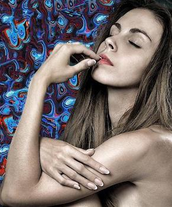

# Texture Fill

Replace monotone regions in an image with texture.

Texture fill allows you to replace an undesired area in an image with a texture of your choice. The texture you provide need not be big enough to cover the entire area; a small sample is enough to provide a start from which more texture is generated. 

Potential uses are swapping uniform portrait backgrounds for something more exciting, or just fun image manipulation. For example, turning water into sand or pavement into grass!


### Usage

To start, run area_select.py with your desired image.

```
python area_select.py example_images/model.jpg

Would you like to select the region to be filled (0) or the sample texture region (1)?
0 or 1: 0
```


When the image opens, click within the area you're thinking of replacing. Note you can do this multiple times and the new areas will be added on to the selection rather than replace it. The flood fill will take a few seconds and then display the current selection. When you are happy with it, simply close the image and the selection will automatically be saved. (_drawback: there is no undo as of yet, so if you mess up you will need to start over_)

Next, run area_select.py again, this time with the source texture image.

```
python area_select.py example_images/texture.jpg

Would you like to select the region to be filled (0) or the sample texture region (1)?
0 or 1: 1
```


This time, click on the image to define the vertices of a polygon around your desired texture. The plot will update with every click to show the sides of the current selection. Double click to end the selection; this will automatically connect back to your starting point. Then, close the image and the selection will again automatically be saved. Keep in mind, you can draw any shape here, but when used for texture synthesis in the next step, it _will be adjusted to a rectangle_.

Finally, run texture_fill.py with the target and source images, and sit back as your selection is filled in with the new texture. 

```
python texture_fill.py example_images/model.jpg example_images/texture.jpg
```



This part takes a while so you will get regular updates of the number of pixels left to be filled in. Once finished the final image will automatically be saved in the same folder, and then opened so you can admire the result. 

Keep in mind that the selections saved in the previous steps are masks only! This means they define the coordinates of interest, but have no knowledge of which image they came from. Make sure you specify the correct images here. 

Also note that the sample texture may come from the same image as the target area. In that case it's sufficient to specify just one image argument.

### Implementation Notes

Texture is synthesized using the [Efros-Leung approach](https://www2.eecs.berkeley.edu/Research/Projects/CS/vision/papers/efros-iccv99.pdf), but done patch by patch rather than point by point for performance reasons.

At each iteration of texture synthesis, a patch of sample texture deemed suitable for the target region is copied over. This decision involves an element of randomization, i.e. we don't always choose the top similar patch but rather one of the top few. Because of this you can run the script multiple times without changing the selections and get slightly different results.

### Limitations

The __color threshold__ used for flood filling the target area is currently preset. This means it can not easily be adjusted according to the level of homogeneity of the area. 

Similarly, the __patch size__ used to tack on new bits of texture is preset. It will work well for some textures but not so much for others. For example, if the patch size is smaller than a single grain of texture, the synthesized texture will likely look off.

__Speed__. We are dealing with a lot of pixels here! On the flood fill side each pixel going outward from the initial selection is individually evaluated for color fitness. The _skimage_ library provides fast color computations, but things still add up. On the texture synthesis side, comparisons to candidate patches takes up the bulk of the time.